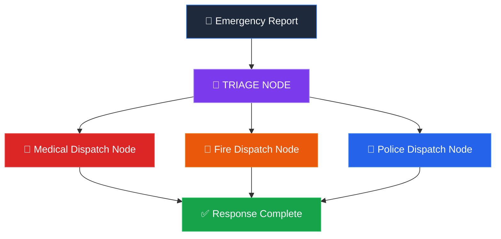

<p align="center">
  
</p>

<h1 align="center">
  🚨 Crisis Dispatch
</h1>

<p align="center">
  <strong>AI-Powered Emergency Response Coordination System</strong><br/>
  <em>Triage. Dispatch. Save Lives — in under 3 seconds.</em>
</p>

<p align="center">
  
  
  
  
  
  
</p>

<p align="center">
  <a href="#-demo-flow">Demo</a> •
  <a href="#-the-problem">Problem</a> •
  <a href="#-architecture">Architecture</a> •
  <a href="#-features">Features</a> •
  <a href="#-tech-stack">Tech Stack</a> •
  <a href="#-quick-start">Quick Start</a> •
  <a href="#-api-reference">API</a> •
  <a href="#-team">Team</a>
</p>

---

## 💀 The Problem

> **Every second counts in an emergency.** Traditional dispatch systems rely on human operators manually triaging calls, looking up nearest hospitals, and coordinating across police, fire, and medical agencies — a process that takes **5–15 minutes**.
>
> In mass casualty events, this delay costs lives.

**Crisis Dispatch** replaces this with a fully autonomous AI pipeline that:

1. 🎤 Takes a **voice or text** emergency report from any device
2. 🧠 **AI-triages** the incident in real-time (severity, category, resources needed)
3. 🗺️ **Geo-dispatches** the 3 optimal response units (medical, fire, police) **simultaneously**
4. 📡 Pushes live updates to **agency-specific dashboards** with routing + ETA

**Total time: ~2.5 seconds** from report to dispatch.

---

## 🎬 Demo Flow

```
┌──────────────────────────────────────────────────────────────┐
│  👤 CIVILIAN REPORTS EMERGENCY                               │
│  "Massive fire in hotel kitchen, 3 people with severe burns" │
│  📍 GPS: 18.9681, 72.8072                                   │
└───────────────────────┬──────────────────────────────────────┘
                        ▼
┌──────────────────────────────────────────────────────────────┐
│  🧠 AI TRIAGE ENGINE (LangGraph + Groq LLaMA 3.3 70B)       │
│  ┌─────────────────────────────────────────────────────────┐ │
│  │ Category:    FIRE                                       │ │
│  │ Severity:    CRITICAL                                   │ │
│  │ Victims:     3                                          │ │
│  │ Resources:   [fire_engine, burn_unit, trauma_surgeon]   │ │
│  │ TTS:         "Critical fire at hotel. 3 burn victims.   │ │
│  │              Dispatch fire & medical immediately."      │ │
│  └─────────────────────────────────────────────────────────┘ │
└───────────────────────┬──────────────────────────────────────┘
                        ▼
          ┌─────────────┼──────────────┐
          ▼             ▼              ▼
    ┌──────────┐  ┌──────────┐  ┌──────────┐
    │ 🚒 FIRE  │  │ 🏥 MEDIC │  │ 🚓 POLICE│
    │ Nearest  │  │ Best-fit │  │ Security │
    │ Station  │  │ Hospital │  │ Backup   │
    │ 2.3 km   │  │ 4.1 km   │  │ SKIP ✓   │
    │ ETA: 3m  │  │ ETA: 6m  │  │ Not Req. │
    └──────────┘  └──────────┘  └──────────┘
```

---

## 🏗 Architecture

### LangGraph Agentic Workflow

This isn't a simple API call. It's a **stateful, multi-agent graph** built with LangGraph:



| Node | What it Does | Intelligence |
|------|-------------|--------------|
| **Triage** | Classifies emergency, estimates severity, identifies needed resources | LLaMA 3.3 70B via Groq (structured output) |
| **Medical** | Finds nearest hospital with matching capabilities | Haversine geospatial + AI matchmaking |
| **Fire** | Dispatches closest fire station | Haversine + AI capability matching |
| **Police** | Deploys security response | Conditionally skipped if not needed |

> 🔑 **Key Innovation:** The fan-out/fan-in pattern means all 3 dispatch nodes execute **in parallel** after triage — no sequential bottleneck.

### System Architecture

```
┌─────────────────────────────────────────────────────────────────┐
│                        FRONTEND LAYER                           │
│  ┌───────────┐  ┌───────────────┐  ┌──────────┐  ┌──────────┐  │
│  │ SOS Portal│  │ Dispatch Map  │  │ Dashboard│  │ Heatmap  │  │
│  │ (Voice+   │  │ (Leaflet.js)  │  │ (Agency) │  │ (Global) │  │
│  │  Text)    │  │               │  │          │  │          │  │
│  └─────┬─────┘  └───────┬───────┘  └────┬─────┘  └────┬─────┘  │
│        └────────────────┼───────────────┼──────────────┘        │
└─────────────────────────┼───────────────┼───────────────────────┘
                          ▼               ▼
┌─────────────────────────────────────────────────────────────────┐
│                     FASTAPI BACKEND                             │
│  ┌──────────────────────────────────────────────────────────┐   │
│  │                  LangGraph State Machine                 │   │
│  │  ┌──────────┐    ┌──────────┐    ┌──────────────────┐    │   │
│  │  │ Triage   │───▶│ Dispatch │───▶│ Persist to SQLite│    │   │
│  │  │ (Groq)   │    │ (3 nodes)│    │ + Return JSON    │    │   │
│  │  └──────────┘    └──────────┘    └──────────────────┘    │   │
│  └──────────────────────────────────────────────────────────┘   │
│  ┌──────────────────────────────────────────────────────────┐   │
│  │                  DATA LAYER                              │   │
│  │  📊 26,000+ Hospitals  │ 🚒 400+ Fire Stations          │   │
│  │  🚓 15,000+ Police Stations  │ 💾 SQLite Incident DB    │   │
│  └──────────────────────────────────────────────────────────┘   │
└─────────────────────────────────────────────────────────────────┘
```

---

## ✨ Features

### 🎯 Core Engine

| Feature | Description |
|---------|-------------|
| **AI Triage** | Structured LLM output → `{category, severity, victims, resource_vector, tts_summary}` |
| **Multi-Agency Parallel Dispatch** | LangGraph fan-out dispatches medical, fire, police simultaneously |
| **Geospatial Matchmaking** | Vectorized Haversine distance + LLM capability reasoning for optimal unit selection |
| **Real-Time ETA** | Distance-based ETA calculation with live countdown on dashboard |

### 🖥️ User Interfaces

| Page | Purpose |
|------|---------|
| **Dispatch Portal** (`/`) | 3-column layout: GPS + report input → live map → helpline sidebar |
| **Responder Login** (`/login`) | Authenticated agency access (validates against real station datasets) |
| **Command Dashboard** (`/dashboard`) | Live incident feed, interactive map, severity stats, PDF report export |
| **Global Heatmap** (`/heatmap`) | Severity-weighted heat visualization of all historical incidents |

### 🛠️ Supporting Features

- 🎤 **Speech-to-Text** — Browser-native voice transcription for hands-free reporting
- 📎 **File/Image Upload** — Attach evidence to incident reports
- 📄 **PDF Report Generation** — One-click incident reports via jsPDF
- 🗺️ **Interactive Mapping** — Leaflet.js with custom markers, route lines, and popups
- 🔄 **Auto-Refresh Polling** — Dashboard updates every 5 seconds
- 📱 **Responsive Design** — Works on desktop, tablet, and mobile
- ✅ **Incident Resolution** — Mark incidents as resolved from the dashboard
- 📞 **Emergency Helplines Panel** — Quick-access to 100, 101, 102, 108

---

## 🧪 Tech Stack

| Layer | Technology | Why |
|-------|-----------|-----|
| **AI / LLM** | Groq (LLaMA 3.3 70B Versatile) | Fastest inference for real-time triage (~300ms) |
| **Orchestration** | LangGraph (StateGraph) | Stateful multi-agent workflow with parallel fan-out |
| **Structured Output** | LangChain + Pydantic | Type-safe AI responses — no regex parsing |
| **Backend** | FastAPI | Async Python, auto-docs, perfect for AI pipelines |
| **Database** | SQLite | Zero-config persistent storage for incident records |
| **Geospatial** | NumPy + Pandas (Haversine) | Vectorized distance computation across 40,000+ stations |
| **Maps** | Leaflet.js + CartoDB Tiles | Lightweight, open-source, beautiful dark/light themes |
| **Heatmap** | Leaflet.heat | Severity-weighted heat visualization |
| **Voice** | Web Speech API | Browser-native, zero-dependency STT |
| **Reports** | jsPDF | Client-side PDF generation |

### 📊 Datasets

| Dataset | Records | Source |
|---------|---------|--------|
| India Hospital Directory | ~26,000 hospitals | Government open data (cleaned) |
| India Police Stations | ~15,000 stations | Government open data |
| India Fire Stations | ~400 stations | OpenStreetMap extract |

---

## 🚀 Quick Start

### Prerequisites

- Python 3.10+
- A [Groq API Key](https://console.groq.com) (free tier works)

### 1. Clone & Install

```bash
git clone https://github.com/taher51-lang/crisis-dispatch.git
cd crisis-dispatch
pip install -r requirements.txt   # or install manually:
# pip install fastapi uvicorn pandas numpy langchain langchain-groq langgraph python-dotenv pydantic
```

### 2. Configure Environment

```bash
# Create .env file
echo "GROQ_API_KEY=your_groq_api_key_here" > .env
```

### 3. Run

```bash
uvicorn app:app --reload --host 0.0.0.0 --port 8000
```

### 4. Open

| URL | Page |
|-----|------|
| `http://localhost:8000` | 🚨 Dispatch Portal |
| `http://localhost:8000/login` | 🔐 Responder Login |
| `http://localhost:8000/dashboard` | 📊 Command Dashboard |
| `http://localhost:8000/heatmap` | 🗺️ Global Heatmap |

---

## 📡 API Reference

### `POST /api/v1/triage`

The main dispatch endpoint. Accepts an emergency report and returns full triage + multi-agency dispatch.

**Request:**
```json
{
  "latitude": 18.9681,
  "longitude": 72.8072,
  "description": "Massive fire in hotel kitchen, 3 chefs with severe burns",
  "media_url": null
}
```

**Response:**
```json
{
  "id": "INC-A3F2B1C8",
  "timestamp": "2026-04-28T06:00:00.000Z",
  "user_location": { "latitude": 18.9681, "longitude": 72.8072 },
  "triage_analysis": {
    "crisis_category": "FIRE",
    "severity_level": "CRITICAL",
    "estimated_victims": 3,
    "resource_vector": ["fire_engine", "burn_unit_ambulance", "trauma_surgeon"],
    "tts_summary": "Critical fire at hotel. 3 burn victims. Dispatch fire and medical immediately."
  },
  "dispatched_units": {
    "medical": {
      "hospital_name": "Holy Family Hospital",
      "latitude": 19.0456,
      "longitude": 72.8321,
      "distance_km": 4.12,
      "estimated_eta_minutes": 6,
      "ai_reasoning": "Closest hospital with burn unit and trauma surgery capabilities."
    },
    "fire": {
      "unit_name": "Fire Station Colaba",
      "distance_km": 2.31,
      "estimated_eta_minutes": 3,
      "ai_reasoning": "Nearest fire station with full suppression equipment."
    },
    "police": { "status": "Not Required" }
  }
}
```

### Other Endpoints

| Method | Endpoint | Description |
|--------|----------|-------------|
| `POST` | `/api/v1/login` | Responder authentication against station datasets |
| `GET` | `/api/v1/incidents/{station}` | Fetch incidents assigned to a specific station |
| `POST` | `/api/v1/incidents/{id}/resolve` | Mark an incident as resolved |
| `GET` | `/api/v1/all_incidents` | Fetch all incidents (for heatmap) |
| `POST` | `/api/v1/upload` | Upload media/evidence files |

---

## 🧠 How the AI Works

### Step 1: Structured Triage (LLM)

The user's raw report is sent to **LLaMA 3.3 70B** via Groq with a system prompt that forces structured JSON output matching our Pydantic schema:

```python
class EmergencyPayload(BaseModel):
    crisis_category: Literal["MEDICAL", "FIRE", "SECURITY", "CHEMICAL", "STRUCTURAL", "NATURAL_DISASTER"]
    severity_level: Literal["LOW", "MODERATE", "HIGH", "CRITICAL", "MASS_CASUALTY"]
    estimated_victims: int
    resource_vector: List[str]  # ["trauma_surgeon", "fire_engine", ...]
    tts_summary: str
```

### Step 2: Geospatial Filtering (Pandas + NumPy)

For each agency type, we compute vectorized Haversine distances across the entire dataset (40k+ stations) and extract the **5 closest candidates**.

### Step 3: AI Matchmaking (LLM)

The 5 closest candidates + required resources are sent to a second LLM call that **reasons about capability matching**:

> *"Holy Family Hospital is the optimal choice because its stated burn unit and trauma surgery capabilities directly match the required resources, and it is only 4.12 km away."*

### Step 4: Parallel Execution

LangGraph's `StateGraph` executes all three dispatch nodes **in parallel** after triage completes, reducing total latency from ~9s (sequential) to ~3s.

---

## 📁 Project Structure

```
crisis-dispatch/
├── app.py                  # FastAPI backend + LangGraph workflow (643 lines)
├── index.html              # SOS Portal (standalone emergency page)
├── .env                    # API keys (Groq, etc.)
├── templates/
│   ├── index.html          # Main dispatch portal (3-column layout)
│   ├── login.html          # Responder authentication
│   ├── dashboard.html      # Command center dashboard
│   └── heatmap.html        # Global incident heatmap
├── static/
│   ├── app.js              # Frontend dispatch logic + map rendering
│   └── styles.css          # Shared design system
├── data/
│   ├── hospital_directory_cleaned.csv   # 26K hospitals
│   ├── INDIA_POLICE_STATIONS.csv        # 15K police stations
│   └── OpenStreetMap_-_Fire_Station.csv  # 400+ fire stations
├── database/
│   └── dispatch_v2.db      # SQLite incident persistence
├── uploads/                # Uploaded evidence files
└── tests/
    └── test_csv.py          # Dataset validation
```

---

## 🏆 What Makes This Hackathon-Worthy

| Dimension | What We Did |
|-----------|-------------|
| **Technical Depth** | LangGraph multi-agent state machine with parallel fan-out/fan-in, not a basic API wrapper |
| **Real Data** | 40,000+ actual government stations — not mock data |
| **AI Innovation** | Dual-LLM pipeline: structured triage → capability-aware matchmaking |
| **Full Stack** | 4 production-quality UI pages with maps, charts, PDF export |
| **Sub-3s Latency** | Groq inference + parallel dispatch = real-time emergency response |
| **Impact** | Directly applicable to NDMA, municipal fire departments, hospital networks |

---

## 🛣️ Roadmap

- [ ] 🔔 WebSocket push notifications (replace polling)
- [ ] 📱 Progressive Web App (PWA) with offline caching
- [ ] 🗣️ Multilingual voice input (Hindi, Gujarati, Tamil)
- [ ] 📸 AI image analysis of uploaded evidence (damage assessment)
- [ ] 🤝 Inter-agency resource sharing protocol
- [ ] 📊 Analytics dashboard with historical trend analysis

---

## 👥 Team

Built with ❤️ and urgency at **GDG Hackathon 2026**

---

<p align="center">
  <sub>
    <strong>Crisis Dispatch</strong> — Because the difference between life and death is measured in seconds, not minutes.
  </sub>
</p>
